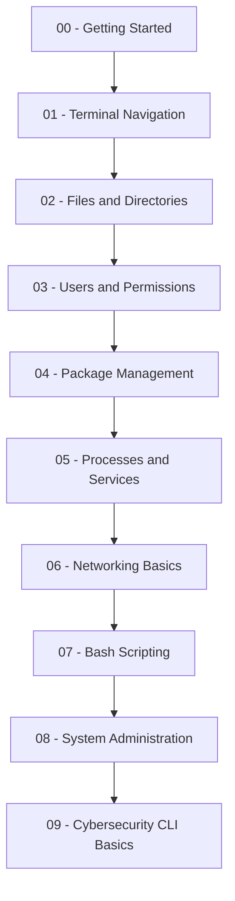
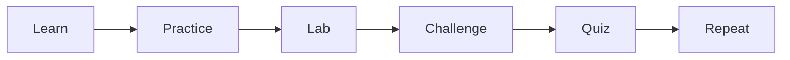

# 🐧 Linux School

<div align="center">

```text
██╗     ██╗███╗   ██╗██╗   ██╗██╗  ██╗    ███████╗ ██████╗██╗  ██╗ ██████╗  ██████╗ ██╗     
██║     ██║████╗  ██║██║   ██║╚██╗██╔╝    ██╔════╝██╔════╝██║  ██║██╔═══██╗██╔═══██╗██║     
██║     ██║██╔██╗ ██║██║   ██║ ╚███╔╝     ███████╗██║     ███████║██║   ██║██║   ██║██║     
██║     ██║██║╚██╗██║██║   ██║ ██╔██╗     ╚════██║██║     ██╔══██║██║   ██║██║   ██║██║     
███████╗██║██║ ╚████║╚██████╔╝██╔╝ ██╗    ███████║╚██████╗██║  ██║╚██████╔╝╚██████╔╝███████╗
╚══════╝╚═╝╚═╝  ╚═══╝ ╚═════╝ ╚═╝  ╚═╝    ╚══════╝ ╚═════╝╚═╝  ╚═╝ ╚═════╝  ╚═════╝ ╚══════╝
```

### A command line school for learning Linux through real terminal practice.


</div>

---

## 🧠 What Is Linux School?

**Linux School** is a hands-on command line learning project built for beginners who want to understand Linux by actually using it.

This is not just a notes repository.

This is a structured CLI school built around:

<table>
<tr>
<td><strong>Lessons</strong></td>
<td>Step-by-step learning modules</td>
</tr>
<tr>
<td><strong>Labs</strong></td>
<td>Hands-on command line exercises</td>
</tr>
<tr>
<td><strong>Challenges</strong></td>
<td>Skill-building CLI missions</td>
</tr>
<tr>
<td><strong>Cheatsheets</strong></td>
<td>Fast references for commands and concepts</td>
</tr>
<tr>
<td><strong>Scripts</strong></td>
<td>Real Bash automation examples</td>
</tr>
<tr>
<td><strong>Quizzes</strong></td>
<td>Knowledge checks after each module</td>
</tr>
</table>

---

## 🎯 Mission

The mission of Linux School is simple:

> Teach Linux command line skills through repetition, structure, and real-world practice.

The goal is to help learners move from:

```text
"I have no idea what this terminal does."
```

to:

```text
"I can navigate, troubleshoot, script, and understand Linux systems."
```

---

## 🧭 Learning Roadmap



---

## 🏗️ Repository Structure

```text
Linux-School/
├── README.md
├── roadmap.md
├── CONTRIBUTING.md
├── docs/
│   ├── index.md
│   ├── getting-started.md
│   └── setup.md
├── lessons/
│   ├── 00-getting-started/
│   ├── 01-navigation/
│   ├── 02-files-and-directories/
│   ├── 03-users-and-permissions/
│   ├── 04-package-management/
│   ├── 05-processes-and-services/
│   ├── 06-networking-basics/
│   ├── 07-bash-scripting/
│   ├── 08-system-admin/
│   └── 09-cybersecurity-cli/
├── labs/
├── challenges/
│   ├── beginner/
│   ├── intermediate/
│   └── advanced/
├── cheatsheets/
├── scripts/
└── quizzes/
```

---

## 🧪 How The School Works

Each module follows the same training pattern:



### Every lesson includes:

* A simple explanation
* Real commands
* Example output
* Practice tasks
* A hands-on lab
* A short quiz
* A challenge mission

---

## 🚀 Start Here

New learners should begin with:

```text
lessons/00-getting-started/
```

Then complete:

```text
labs/lab-01-terminal-basics.md
```

Recommended first commands:

```bash
pwd
ls
ls -la
cd
whoami
clear
date
uname -a
```

---

## 🧰 Core Skills You Will Build

| Skill Area      | What You Will Learn                              |
| --------------- | ------------------------------------------------ |
| Terminal Basics | How to use the command line confidently          |
| File System     | How Linux directories and paths work             |
| Permissions     | How users, groups, and file access work          |
| Packages        | How to install and remove software               |
| Processes       | How to view and manage running programs          |
| Services        | How Linux services work                          |
| Networking      | How to check IPs, ports, routes, and connections |
| Bash            | How to write simple automation scripts           |
| SysAdmin        | How to perform basic Linux administration        |
| Cyber CLI       | How security tools use the terminal              |

---

## 🖥️ CLI Example

```bash
# Show current directory
pwd

# List files
ls -la

# Move into a directory
cd lessons

# Return home
cd ~

# Show current user
whoami
```

Expected mindset:

```text
Do not just memorize commands.
Run them.
Break them.
Fix them.
Repeat them.
```

---

## 🧩 Beginner Challenge Preview

### Challenge: File Hunter

Objective:

```text
Create a directory, add files, move around the file system, and prove you understand where everything is located.
```

Commands used:

```bash
mkdir
cd
touch
ls
pwd
rm
```

Completion requirement:

```text
You can explain what each command did and why you used it.
```

---

## 🛡️ Cybersecurity Track

Linux School includes a beginner-friendly cybersecurity CLI track.

Topics include:

* Linux file permissions
* Basic networking commands
* Nmap fundamentals
* Log review basics
* Hashing commands
* Process inspection
* Safe lab environments
* Defensive Linux habits

This project focuses on ethical, legal, and educational practice.

---

## 📚 Current Modules

| Module | Topic                    | Status   |
| ------ | ------------------------ | -------- |
| 00     | Getting Started          | Building |
| 01     | Navigation               | Planned  |
| 02     | Files and Directories    | Planned  |
| 03     | Users and Permissions    | Planned  |
| 04     | Package Management       | Planned  |
| 05     | Processes and Services   | Planned  |
| 06     | Networking Basics        | Planned  |
| 07     | Bash Scripting           | Planned  |
| 08     | System Administration    | Planned  |
| 09     | Cybersecurity CLI Basics | Planned  |

---

## 🧠 Learning Philosophy

Linux School is built on one rule:

> The terminal only becomes comfortable after you use it repeatedly.

This project uses a simple loop:

```text
Read → Type → Observe → Break → Fix → Repeat
```

That is how real command line confidence is built.

---

## 📌 Project Status

This project is currently under active development.

Planned additions:

* Full beginner lesson path
* CLI labs
* Bash scripts
* GitHub Pages documentation site
* Cybersecurity command line modules
* Visual roadmap
* Downloadable cheatsheets
* Student-style quizzes

---

## 🤝 Contributing

Contributions are welcome once the foundation is complete.

Future contribution areas:

* Lesson improvements
* Lab ideas
* Command examples
* Bash scripts
* Cheatsheets
* Beginner-friendly explanations

---

## 📄 License

This project is licensed under the MIT License.

---

<div align="center">

## Linux School

### Learn the terminal. Build the skill. Control the system.

```text
root@linux-school:~$ start-learning
```

</div>
