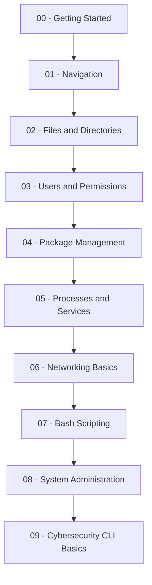
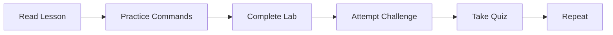

# 🐧 Linux School

<div align="center">

```text
██╗     ██╗███╗   ██╗██╗   ██╗██╗  ██╗    ███████╗ ██████╗██╗  ██╗ ██████╗  ██████╗ ██╗     
██║     ██║████╗  ██║██║   ██║╚██╗██╔╝    ██╔════╝██╔════╝██║  ██║██╔═══██╗██╔═══██╗██║     
██║     ██║██╔██╗ ██║██║   ██║ ╚███╔╝     ███████╗██║     ███████║██║   ██║██║   ██║██║     
██║     ██║██║╚██╗██║██║   ██║ ██╔██╗     ╚════██║██║     ██╔══██║██║   ██║██║   ██║██║     
███████╗██║██║ ╚████║╚██████╔╝██╔╝ ██╗    ███████║╚██████╗██║  ██║╚██████╔╝╚██████╔╝███████╗
╚══════╝╚═╝╚═╝  ╚═══╝ ╚═════╝ ╚═╝  ╚═╝    ╚══════╝ ╚═════╝╚═╝  ╚═╝ ╚═════╝  ╚═════╝ ╚══════╝
```

### A hands-on command line school for learning Linux through real terminal practice.


</div>

---

## 🧠 What Is Linux School?

**Linux School** is a structured Linux command line learning project.

This repository is built like a real school:

| Area           | Purpose                              |
| -------------- | ------------------------------------ |
| `lessons/`     | Step-by-step learning modules        |
| `labs/`        | Hands-on terminal exercises          |
| `challenges/`  | Mission-based skill checks           |
| `cheatsheets/` | Quick command references             |
| `scripts/`     | Bash scripts and automation examples |
| `quizzes/`     | Knowledge checks                     |
| `docs/`        | Future GitHub Pages documentation    |

This is not just a notes repo.

This is a practical CLI training system.

---

## 🎯 Mission

The mission of Linux School is simple:

> Teach Linux command line skills through repetition, structure, labs, and real-world practice.

The goal is to move learners from:

```text
"I do not understand the terminal."
```

to:

```text
"I can navigate, create, troubleshoot, script, and manage Linux systems from the command line."
```

---

## 📚 Module Index

| Module | Topic                    | Lesson                                                                                                        | Practice                                                 | Lab                                            | Challenge                                                                  | Quiz                                                |
| ------ | ------------------------ | ------------------------------------------------------------------------------------------------------------- | -------------------------------------------------------- | ---------------------------------------------- | -------------------------------------------------------------------------- | --------------------------------------------------- |
| 00     | Getting Started          | [Start](lessons/00-getting-started/README.md)                                                                 | [Commands](lessons/00-getting-started/commands.md)       | [Lab 01](labs/lab-01-terminal-basics.md)       | Coming Soon                                                                | [Quiz 01](quizzes/quiz-01-terminal-basics.md)       |
| 01     | Navigation               | [Overview](lessons/01-navigation/README.md) / [Lesson](lessons/01-navigation/lesson.md)                       | [Practice](lessons/01-navigation/practice.md)            | [Lab 02](labs/lab-02-file-navigation.md)       | [File Hunter](challenges/beginner/challenge-01-file-hunter.md)             | [Quiz 02](quizzes/quiz-02-navigation.md)            |
| 02     | Files and Directories    | [Overview](lessons/02-files-and-directories/README.md) / [Lesson](lessons/02-files-and-directories/lesson.md) | [Practice](lessons/02-files-and-directories/practice.md) | [Lab 03](labs/lab-03-files-and-directories.md) | [Directory Builder](challenges/beginner/challenge-02-directory-builder.md) | [Quiz 03](quizzes/quiz-03-files-and-directories.md) |
| 03     | Users and Permissions    | Planned                                                                                                       | Planned                                                  | Planned                                        | Planned                                                                    | Planned                                             |
| 04     | Package Management       | Planned                                                                                                       | Planned                                                  | Planned                                        | Planned                                                                    | Planned                                             |
| 05     | Processes and Services   | Planned                                                                                                       | Planned                                                  | Planned                                        | Planned                                                                    | Planned                                             |
| 06     | Networking Basics        | Planned                                                                                                       | Planned                                                  | Planned                                        | Planned                                                                    | Planned                                             |
| 07     | Bash Scripting           | Planned                                                                                                       | Planned                                                  | Planned                                        | Planned                                                                    | Planned                                             |
| 08     | System Administration    | Planned                                                                                                       | Planned                                                  | Planned                                        | Planned                                                                    | Planned                                             |
| 09     | Cybersecurity CLI Basics | Planned                                                                                                       | Planned                                                  | Planned                                        | Planned                                                                    | Planned                                             |

---

## 🧭 Learning Roadmap



---

## 🧪 How The School Works

Each module follows the same training loop:



Every module should include:

1. A module overview
2. A full lesson
3. A practice file
4. A hands-on lab
5. A challenge
6. A quiz

---

## 🏗️ Repository Structure

```text
Linux-School/
├── README.md
├── roadmap.md
├── CONTRIBUTING.md
├── docs/
│   ├── index.md
│   ├── getting-started.md
│   └── setup.md
├── lessons/
│   ├── 00-getting-started/
│   ├── 01-navigation/
│   ├── 02-files-and-directories/
│   ├── 03-users-and-permissions/
│   ├── 04-package-management/
│   ├── 05-processes-and-services/
│   ├── 06-networking-basics/
│   ├── 07-bash-scripting/
│   ├── 08-system-admin/
│   └── 09-cybersecurity-cli/
├── labs/
├── challenges/
│   ├── beginner/
│   ├── intermediate/
│   └── advanced/
├── cheatsheets/
├── scripts/
└── quizzes/
```

---

## 🚀 Start Here

New learners should begin with:

```text
lessons/00-getting-started/
```

Then continue to:

```text
lessons/01-navigation/
lessons/02-files-and-directories/
```

Recommended first commands:

```bash
pwd
ls
ls -la
cd
whoami
clear
date
uname -a
```

---

## 🧰 Core Skills You Will Build

| Skill Area            | What You Will Learn                                             |
| --------------------- | --------------------------------------------------------------- |
| Terminal Basics       | How to use the command line confidently                         |
| File System           | How Linux directories and paths work                            |
| Files and Directories | How to create, copy, move, rename, view, and delete files       |
| Permissions           | How users, groups, ownership, and file permissions work         |
| Packages              | How to install and remove software                              |
| Processes             | How to view and manage running programs                         |
| Services              | How Linux services work                                         |
| Networking            | How to check IP addresses, ports, routes, DNS, and connectivity |
| Bash                  | How to write simple automation scripts                          |
| SysAdmin              | How to perform basic Linux administration                       |
| Cyber CLI             | How security tools use the terminal                             |

---

## 🖥️ CLI Example

```bash
# Show current directory
pwd

# List files
ls -la

# Move into a directory
cd lessons

# Return home
cd ~

# Show current user
whoami
```

Terminal mindset:

```text
Do not just memorize commands.
Run them.
Break them.
Fix them.
Repeat them.
```

---

## 🧩 Beginner Challenges

| Challenge    | Topic             | Link                                                          |
| ------------ | ----------------- | ------------------------------------------------------------- |
| Challenge 01 | File Hunter       | [Open](challenges/beginner/challenge-01-file-hunter.md)       |
| Challenge 02 | Directory Builder | [Open](challenges/beginner/challenge-02-directory-builder.md) |
| Challenge 03 | Permission Fix    | Planned                                                       |

---

## 🛡️ Cybersecurity Track

Linux School includes a beginner-friendly cybersecurity CLI path.

Planned topics include:

* Linux file permissions
* User and group awareness
* Basic networking commands
* Nmap fundamentals
* Log review basics
* Hashing files
* Process inspection
* Safe lab environments
* Defensive Linux habits

This project focuses on ethical, legal, and educational practice.

---

## 📌 Project Status

Current progress:

| Module | Topic                    | Status  |
| ------ | ------------------------ | ------- |
| 00     | Getting Started          | Built   |
| 01     | Navigation               | Built   |
| 02     | Files and Directories    | Built   |
| 03     | Users and Permissions    | Next    |
| 04     | Package Management       | Planned |
| 05     | Processes and Services   | Planned |
| 06     | Networking Basics        | Planned |
| 07     | Bash Scripting           | Planned |
| 08     | System Administration    | Planned |
| 09     | Cybersecurity CLI Basics | Planned |

---

## 🧠 Learning Philosophy

Linux School is built on one rule:

> The terminal only becomes comfortable after you use it repeatedly.

The training loop:

```text
Read → Type → Observe → Break → Fix → Repeat
```

---

## 🤝 Contributing

Contributions will be welcomed once the core foundation is complete.

Future contribution areas:

* Lesson improvements
* Lab ideas
* Command examples
* Bash scripts
* Cheatsheets
* Beginner-friendly explanations

---

## 📄 License

This project is licensed under the MIT License.

---

<div align="center">

## Linux School

### Learn the terminal. Build the skill. Control the system.

```text
root@linux-school:~$ start-learning
```

</div>
