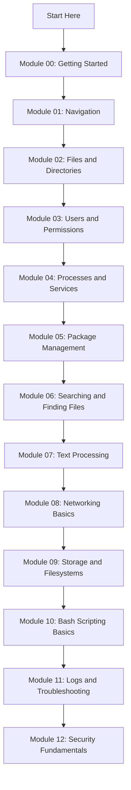

<div align="center">

```text
██╗     ██╗███╗   ██╗██╗   ██╗██╗  ██╗    ███████╗ ██████╗██╗  ██╗ ██████╗  ██████╗ ██╗     
██║     ██║████╗  ██║██║   ██║╚██╗██╔╝    ██╔════╝██╔════╝██║  ██║██╔═══██╗██╔═══██╗██║     
██║     ██║██╔██╗ ██║██║   ██║ ╚███╔╝     ███████╗██║     ███████║██║   ██║██║   ██║██║     
██║     ██║██║╚██╗██║██║   ██║ ██╔██╗     ╚════██║██║     ██╔══██║██║   ██║██║   ██║██║     
███████╗██║██║ ╚████║╚██████╔╝██╔╝ ██╗    ███████║╚██████╗██║  ██║╚██████╔╝╚██████╔╝███████╗
╚══════╝╚═╝╚═╝  ╚═══╝ ╚═════╝ ╚═╝  ╚═╝    ╚══════╝ ╚═════╝╚═╝  ╚═╝ ╚═════╝  ╚═════╝ ╚══════╝
```

# Linux School

### Hands-On Linux CLI Training Repository

**Built by [m4ckDev](https://github.com/m4ckDev)**


</div>

---

## Mission

**Linux School** is a hands-on learning repository built to teach Linux command line skills through real terminal practice.

This repo is designed to help learners open a terminal, run commands, break small things, fix mistakes, and build confidence.

```text
root@linux-school:~$ learn
root@linux-school:~$ practice
root@linux-school:~$ troubleshoot
root@linux-school:~$ repeat
```

---

## Who This Repo Is For

Linux School is for:

- New Linux users
- Cybersecurity students
- Homelab builders
- Help desk learners
- Future system administrators
- Anyone who wants to stop being scared of the terminal

No advanced Linux experience is required.

---

## Learning Philosophy

```text
Explain it.
Show the command.
Run the command.
Read the output.
Fix a mistake.
Repeat.
```

Linux is learned through repetition, not memorization.

---

## Current Module Roadmap

| Module | Topic | Overview | Lesson | Practice | Lab | Challenge | Quiz | Status |
|---|---|---|---|---|---|---|---|---|
| 00 | Getting Started | [Overview](lessons/00-getting-started/README.md) | [Lesson](lessons/00-getting-started/lesson.md) | [Practice](lessons/00-getting-started/practice.md) | [Lab](labs/lab-01-getting-started.md) | [Challenge](challenges/beginner/challenge-00-getting-started.md) | [Quiz](quizzes/quiz-01-getting-started.md) | Built |
| 01 | Navigation | [Overview](lessons/01-navigation/README.md) | [Lesson](lessons/01-navigation/lesson.md) | [Practice](lessons/01-navigation/practice.md) | [Lab](labs/lab-02-navigation.md) | [Challenge](challenges/beginner/challenge-01-navigation.md) | [Quiz](quizzes/quiz-02-navigation.md) | Built |
| 02 | Files and Directories | [Overview](lessons/02-files-and-directories/README.md) | [Lesson](lessons/02-files-and-directories/lesson.md) | [Practice](lessons/02-files-and-directories/practice.md) | [Lab](labs/lab-03-files-and-directories.md) | [Challenge](challenges/beginner/challenge-02-files-and-directories.md) | [Quiz](quizzes/quiz-03-files-and-directories.md) | Built |
| 03 | Users and Permissions | [Overview](lessons/03-users-and-permissions/README.md) | [Lesson](lessons/03-users-and-permissions/lesson.md) | [Practice](lessons/03-users-and-permissions/practice.md) | [Lab](labs/lab-04-users-and-permissions.md) | [Challenge](challenges/beginner/challenge-03-permission-fix.md) | [Quiz](quizzes/quiz-04-users-and-permissions.md) | In Progress |
| 04 | Processes and Services | [Overview](lessons/04-processes-and-services/README.md) | [Lesson](lessons/04-processes-and-services/lesson.md) | [Practice](lessons/04-processes-and-services/practice.md) | [Lab](labs/lab-05-processes-and-services.md) | [Challenge](challenges/beginner/challenge-04-processes-and-services.md) | [Quiz](quizzes/quiz-05-processes-and-services.md) | Scaffolded |
| 05 | Package Management | [Overview](lessons/05-package-management/README.md) | [Lesson](lessons/05-package-management/lesson.md) | [Practice](lessons/05-package-management/practice.md) | [Lab](labs/lab-06-package-management.md) | [Challenge](challenges/beginner/challenge-05-package-management.md) | [Quiz](quizzes/quiz-06-package-management.md) | Scaffolded |
| 06 | Searching and Finding Files | [Overview](lessons/06-searching-and-finding-files/README.md) | [Lesson](lessons/06-searching-and-finding-files/lesson.md) | [Practice](lessons/06-searching-and-finding-files/practice.md) | [Lab](labs/lab-07-searching-and-finding-files.md) | [Challenge](challenges/beginner/challenge-06-searching-and-finding-files.md) | [Quiz](quizzes/quiz-07-searching-and-finding-files.md) | Scaffolded |
| 07 | Text Processing | [Overview](lessons/07-text-processing/README.md) | [Lesson](lessons/07-text-processing/lesson.md) | [Practice](lessons/07-text-processing/practice.md) | [Lab](labs/lab-08-text-processing.md) | [Challenge](challenges/beginner/challenge-07-text-processing.md) | [Quiz](quizzes/quiz-08-text-processing.md) | Scaffolded |
| 08 | Networking Basics | [Overview](lessons/08-networking-basics/README.md) | [Lesson](lessons/08-networking-basics/lesson.md) | [Practice](lessons/08-networking-basics/practice.md) | [Lab](labs/lab-09-networking-basics.md) | [Challenge](challenges/beginner/challenge-08-networking-basics.md) | [Quiz](quizzes/quiz-09-networking-basics.md) | Scaffolded |
| 09 | Storage and Filesystems | [Overview](lessons/09-storage-and-filesystems/README.md) | [Lesson](lessons/09-storage-and-filesystems/lesson.md) | [Practice](lessons/09-storage-and-filesystems/practice.md) | [Lab](labs/lab-10-storage-and-filesystems.md) | [Challenge](challenges/beginner/challenge-09-storage-and-filesystems.md) | [Quiz](quizzes/quiz-10-storage-and-filesystems.md) | Scaffolded |
| 10 | Bash Scripting Basics | [Overview](lessons/10-bash-scripting-basics/README.md) | [Lesson](lessons/10-bash-scripting-basics/lesson.md) | [Practice](lessons/10-bash-scripting-basics/practice.md) | [Lab](labs/lab-11-bash-scripting-basics.md) | [Challenge](challenges/beginner/challenge-10-bash-scripting-basics.md) | [Quiz](quizzes/quiz-11-bash-scripting-basics.md) | Scaffolded |
| 11 | Logs and Troubleshooting | [Overview](lessons/11-logs-and-troubleshooting/README.md) | [Lesson](lessons/11-logs-and-troubleshooting/lesson.md) | [Practice](lessons/11-logs-and-troubleshooting/practice.md) | [Lab](labs/lab-12-logs-and-troubleshooting.md) | [Challenge](challenges/beginner/challenge-11-logs-and-troubleshooting.md) | [Quiz](quizzes/quiz-12-logs-and-troubleshooting.md) | Scaffolded |
| 12 | Security Fundamentals | [Overview](lessons/12-security-fundamentals/README.md) | [Lesson](lessons/12-security-fundamentals/lesson.md) | [Practice](lessons/12-security-fundamentals/practice.md) | [Lab](labs/lab-13-security-fundamentals.md) | [Challenge](challenges/beginner/challenge-12-security-fundamentals.md) | [Quiz](quizzes/quiz-13-security-fundamentals.md) | Scaffolded |

---

## Status Key

| Status | Meaning |
|---|---|
| Built | File exists and has usable learning content |
| In Progress | Module is actively being developed |
| Scaffolded | File exists, links work, full content will be expanded later |
| Planned | Not created yet |

---

## Repository Structure

```text
Linux-School/
├── README.md
├── lessons/
│   ├── 00-getting-started/
│   ├── 01-navigation/
│   ├── 02-files-and-directories/
│   ├── 03-users-and-permissions/
│   ├── 04-processes-and-services/
│   ├── 05-package-management/
│   ├── 06-searching-and-finding-files/
│   ├── 07-text-processing/
│   ├── 08-networking-basics/
│   ├── 09-storage-and-filesystems/
│   ├── 10-bash-scripting-basics/
│   ├── 11-logs-and-troubleshooting/
│   └── 12-security-fundamentals/
├── labs/
├── challenges/
│   └── beginner/
├── quizzes/
└── tools/
```

---

## Learning Path Flow



---

## Skills Covered

| Skill Area | Examples |
|---|---|
| Terminal basics | `pwd`, `clear`, command history |
| Navigation | `cd`, `ls`, paths |
| File management | `touch`, `mkdir`, `cp`, `mv`, `rm` |
| Viewing files | `cat`, `less`, `head`, `tail` |
| Users and groups | `whoami`, `id`, `groups` |
| Permissions | `chmod`, `chown`, `stat` |
| Processes | `ps`, `top`, `kill` |
| Services | `systemctl`, service status checks |
| Packages | `apt`, package updates |
| Searching | `find`, `grep`, `locate` |
| Networking | `ip`, `ping`, `ss`, `curl` |
| Storage | `df`, `du`, `lsblk`, `mount` |
| Scripting | Bash basics and automation |
| Logs | Reading and troubleshooting system logs |
| Security | Safer permissions and system awareness |

---

## Recommended Practice Environment

Use a safe Linux environment:

- Ubuntu virtual machine
- Debian virtual machine
- Kali Linux virtual machine
- WSL on Windows
- Raspberry Pi
- Spare Linux laptop
- Cloud Linux instance

For beginners, Ubuntu or Debian is recommended.

---

## Safe Practice Folder

```bash
mkdir -p ~/linux-school-practice
cd ~/linux-school-practice
```

Do not practice destructive commands in important folders.

Avoid running commands as `sudo` unless the lesson specifically tells you to.

---

## Safety Rules

Before running a command, ask:

```text
What does this command do?
Where am I running it?
What files or folders will it affect?
Can I undo this?
```

Important rules:

1. Always check your location with `pwd`.
2. List files before deleting anything.
3. Be careful with `rm`.
4. Do not copy random `sudo` commands.
5. Practice in a lab, VM, or safe folder.
6. Read errors instead of ignoring them.

---

## For Cybersecurity Learners

Linux is a core cybersecurity skill.

This repo builds the foundation needed for:

- Kali Linux
- Penetration testing
- Capture the Flag practice
- Log analysis
- Server hardening
- File permission auditing
- Bash scripting
- Network troubleshooting
- Homelab administration

```text
Tools change.
Linux fundamentals stay.
```

---

## Current Build Focus

```text
Current module:
  03-users-and-permissions

Completed Module 03 files:
  lessons/03-users-and-permissions/README.md
  lessons/03-users-and-permissions/lesson.md
  lessons/03-users-and-permissions/practice.md

Next deep-build files:
  labs/lab-04-users-and-permissions.md
  challenges/beginner/challenge-03-permission-fix.md
  quizzes/quiz-04-users-and-permissions.md
```

---

## Contribution Notes

Each module should include:

```text
README.md
lesson.md
practice.md
lab file
challenge file
quiz file
```

Rule for links:

```text
Only link to files after they exist.
```

Now that the full course is scaffolded, roadmap links should stay live while detailed content is expanded.

---

## License

This project is for educational use.

A formal license may be added later.

---

<div align="center">

```text
root@linux-school:~$ start-learning
```

**Open the terminal. Run the commands. Build the skill.**

</div>
